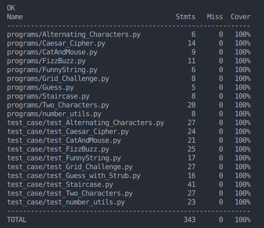

# Test Case 240-123 Module Data Structure, Algorithms and Programming

## นายปุรัสกร เกียรติ์นนทพัทธ์ รหัสนักศึกษา : 6710110270



### ที่อยู่ไฟล์

```bash
TEST_CASE/
├── programs/
│   ├── Alternating_Characters.py
│   ├── Caesar_Cipher.py
│   ├── CatAndMouse.py
│   ├── FizzBuzz.py
│   ├── FunnyString.py
│   ├── Grid_Challenge.py
│   ├── Guess.py
│   ├── number_utils.py
│   ├── Staircase.py
│   └── Two_Characters.py
├── test_case/
│   ├── test_Alternating_Characters.py
│   ├── test_Caesar_Cipher.py
│   ├── test_CatAndMouse.py
│   ├── test_FizzBuzz.py
│   ├── test_FunnyString.py
│   ├── test_Grid_Challenge.py
│   ├── test_Guess_with_Strub.py
│   ├── test_number_utils.py
│   ├── test_Staircase.py
│   └──  test_Two_Characters.py
├── .gitignore
├── README.md
```
